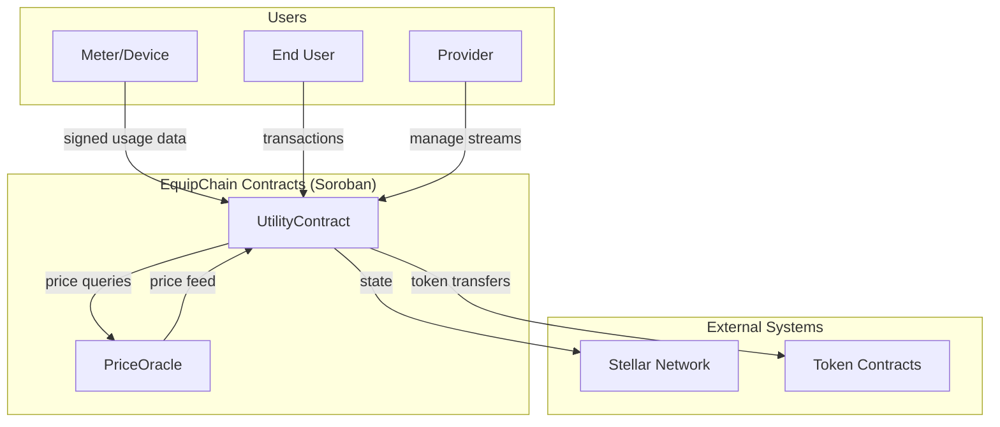
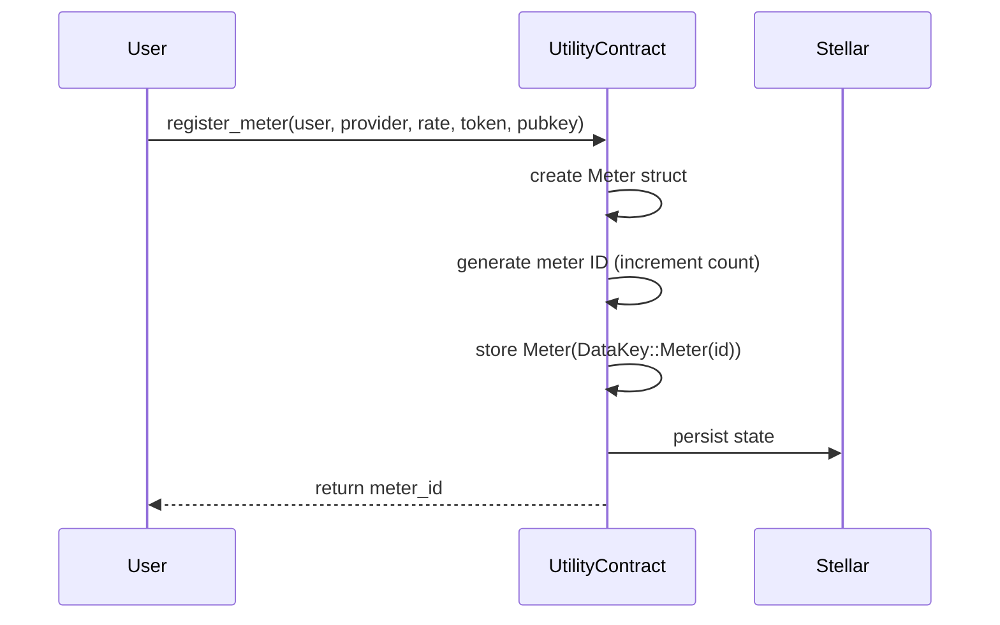
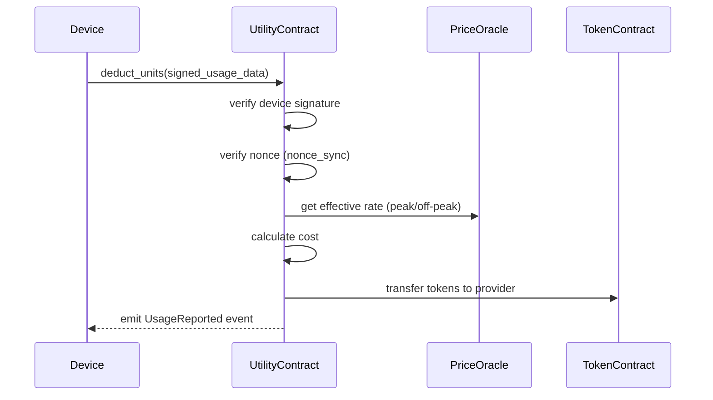
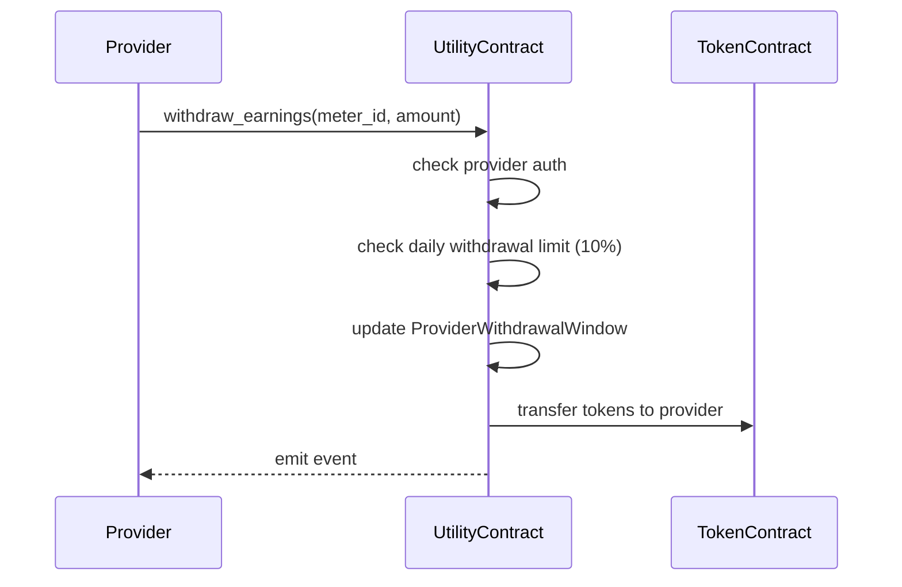

# EquipChain Contracts — Architecture Documentation

> **Version:** 0.0.0  
> **Network:** Stellar Soroban  
> **Last Updated:** 2026-07-25

---

## Table of Contents

1. [High-Level System Diagram](#1-high-level-system-diagram)
2. [Data Flow Diagrams](#2-data-flow-diagrams)
3. [Module Dependency Graph](#3-module-dependency-graph)
4. [Storage Layout Documentation](#4-storage-layout-documentation)
5. [Contract Interfaces](#5-contract-interfaces)
6. [Key Constants & Parameters](#6-key-constants--parameters)

---

## 1. High-Level System Diagram



### Contract Relationship

```mermaid
graph LR
    UC[UtilityContract<br/>utility_contracts]
    PO[PriceOracle<br/>price_oracle]

    UC -->|cross-contract calls| PO
    PO -->|PriceData| UC

    subgraph "UtilityContract Modules"
        direction TB
        LIB[lib.rs — Core Logic]
        STREAM[stream.rs — Stream Management]
        ENTERPRISE[enterprise.rs — Fleet/P2P]
        GHOST[ghost_sweeper.rs — Ledger Pruning]
        NONCE[nonce_sync.rs — Device Nonces]
        TARIFF[tariff_oracle.rs — ToU Pricing]
        VELOCITY[velocity_limit.rs — Circuit Breaker]
        TEMP[temporary_storage.rs — Temp Opt]
        SECURE[secure_call_interface.rs — X-Contract Security]
        GAS[gas_estimator.rs — Gas Estimation]
        MULTISIG[Multi_Sig.rs — Multi-Sig]
        INSURANCE[insurance_pool.rs — Insurance]
        DUST[dust_sweeper — Dust Sweeping]
    end

    LIB --- STREAM
    LIB --- ENTERPRISE
    LIB --- GHOST
    LIB --- NONCE
    LIB --- TARIFF
    LIB --- VELOCITY
    LIB --- TEMP
    LIB --- SECURE
    LIB --- GAS
    LIB --- MULTISIG
    LIB --- INSURANCE
    LIB --- DUST
```



---

## 2. Data Flow Diagrams

### 2.1 Meter Registration Flow



### 2.2 Usage Reporting & Billing Flow



### 2.3 Provider Withdrawal Flow



---

## 3. Module Dependency Graph

```
lib.rs
  ├── enterprise.rs      — Fleet caps, P2P exchange, priority grid shed
  ├── ghost_sweeper.rs   — Ghost stream pruning after 90 days
  ├── grant_stream_listener.rs — Grant stream integration
  ├── nonce_sync.rs      — Hardware nonce sync (Issue #260)
  ├── secure_call_interface.rs — Secure cross-contract calls
  ├── tariff_oracle.rs   — Time-of-Use pricing oracle (Issue #261)
  ├── temporary_storage.rs — Temp storage optimization
  ├── velocity_limit.rs  — Velocity circuit breaker
  ├── gas_estimator.rs   — Gas cost estimation
  └── gas_metrics.rs     — Gas metrics (test only)

test files (cfg(test)):
  ├── buffer_tests.rs
  ├── debt_fuzz_tests.rs
  ├── dust_sweeper_tests.rs
  ├── fuzz_tests.rs
  ├── ghost_sweeper_tests.rs
  ├── nonce_sync_tests.rs
  ├── pause_resume_tests.rs
  ├── pause_resume_fuzz_tests.rs
  ├── streaming_invariant_tests.rs
  ├── stroop_fuzz_tests.rs
  ├── tariff_oracle_tests.rs
  ├── temporary_storage_tests.rs
  └── test.rs (main test file)
```

---

## 4. Storage Layout Documentation

### 4.1 DataKey Enum — Complete Reference

All contract state is stored via the `DataKey` enum (`lib.rs:939`). Each variant maps to a specific storage slot.

#### Instance Storage (Persistent)

| Key | Type | Description |
|-----|------|-------------|
| `CurrentAdmin` | `Address` | DAO admin address |
| `ComplianceOfficer` | `Address` | Compliance officer address |
| `Oracle` | `Address` | Price oracle contract address |
| `Count` | `u64` | Total meter count |
| `NativeToken` | `Address` | Native token address |
| `PlatformFeeBps` | `i128` | Platform fee in basis points |
| `ProtocolFeeBps` | `i128` | Protocol fee in basis points |
| `ProtocolFeeVault` | `Address` | Protocol fee recipient |
| `GovernmentVault` | `Address` | Tax/government vault |
| `LegalVault` | `Address` | Legal freeze vault |
| `MaintenanceWallet` | `Address` | Maintenance fund wallet |
| `TaxRateBps` | `i128` | Tax rate in basis points |
| `MinRouteThreshold` | `i128` | Minimum yield routing threshold |
| `AutoExtendThreshold` | `u32` | Auto-extend ledger threshold |
| `GridAdministrator` | `Address` | Grid administrator address |
| `ProposedUpgrade` | `UpgradeProposal` | Active upgrade proposal |
| `VetoDeadline` | `u64` | Upgrade veto deadline |
| `VetoCount` | `u32` | Current veto count |
| `UpgradeProposalTime` | `u64` | Upgrade proposal timestamp |
| `DaoGovernor` | `Address` | DAO governor address |
| `GasBountyPool` | `i128` | Gas bounty pool balance |
| `AdminTransferProposal` | `AdminTransferProposal` | Pending admin transfer |
| `UpgradeMultiSigConfig` | `UpgradeMultiSigConfig` | Upgrade multi-sig config |
| `UpgradeProposalCounter` | `u64` | Upgrade proposal counter |
| `ActiveUpgradeProposalId` | `u64` | Current active proposal ID |
| `SeasonalFactor` | `i128` | Seasonal adjustment factor |
| `AuthorizedNonceResetters` | `Vec<Address>` | Nonce reset authorities |
| `TariffOracleAdmin` | `Address` | Tariff oracle admin |
| `CurrentTariffSchedule` | `TariffSchedule` | Active tariff schedule |
| `TariffScheduleHash` | `BytesN<32>` | Tariff schedule hash |
| `TariffProposalCounter` | `u64` | Tariff proposal counter |
| `TodayTariffSchedule` | `TariffSchedule` | Today's tariff schedule |
| `SweeperStatistics` | `SweeperStats` | Ghost sweeper statistics |
| `EmergencyDrainCounter` | `u64` | Emergency drain counter |
| `EmergencyDrainLastExecution` | `u64` | Last drain execution time |
| `ZKEnabledMeters` | `u64` | ZK-enabled meter count |
| `ActiveMetersCount` | `u64` | Active meters counter |
| `ActiveUsers` | `u64` | Active users counter |
| `ReentrancyGuard(u64)` | `bool` | Reentrancy lock per meter |

#### Per-Meter Storage (Persistent)

| Key | Type | Description |
|-----|------|-------------|
| `Meter(u64)` | `Meter` | Meter data (large struct) |
| `ContinuousFlow(u64)` | `ContinuousFlow` | Stream state |
| `BufferVault(u64)` | `i128` | Stream buffer vault |
| `StreamLastHeartbeat(u64)` | `u64` | Last heartbeat timestamp |
| `StreamingFeeAccrued(u64)` | `i128` | Accrued streaming fees |
| `LastAlert(u64)` | `LowBalanceAlert` | Last alert sent |
| `LegalFreeze(u64)` | `LegalFreeze` | Legal freeze state |
| `MaintenanceFund(u64)` | `i128` | Maintenance fund balance |
| `MeterDevice(u64)` | `Address` | Device address per meter |
| `DeviceNonce(BytesN<32>)` | `u64` | Device nonce value |
| `NonceResetRequest(u64)` | `NonceResetRequest` | Pending nonce reset |
| `PrivateBillingStatus(u64)` | `PrivateBillingStatus` | ZK billing status |
| `ConservationGoal(u64)` | `ConservationGoal` | Water conservation goal |
| `SavingGoal(u64)` | `SavingGoal` | Token saving goal |
| `ZKVerificationKey(u64)` | `Groth16VerificationKey` | ZK verification key |
| `ResellerConfig(u64)` | `ResellerConfig` | Reseller fee config |
| `StreamArchive(u64)` | `StreamArchive` | Pruned stream archive |

#### Per-Provider Storage (Persistent)

| Key | Type | Description |
|-----|------|-------------|
| `ProviderWindow(Address)` | `ProviderWithdrawalWindow` | Daily withdrawal tracker |
| `ProviderTotalPool(Address)` | `i128` | Total provider pool value |
| `ProviderVolume(Address)` | `i128` | Provider volume tracker |
| `ProviderGridEpoch(Address)` | `u64` | Grid epoch per provider |
| `GasBuffer(Address)` | `GasBuffer` | Provider gas buffer |
| `FleetAgg(Address)` | `FleetState` | Fleet aggregate state |
| `FleetCap(Address)` | `i128` | Fleet capacity cap |
| `MultiSigConfig(Address)` | `MultiSigConfig` | Multi-sig configuration |
| `VerifiedProvider(Address)` | `VerifiedProvider` | Provider verification |
| `SubDaoConfig(Address)` | `SubDaoConfig` | Sub-DAO configuration |
| `WithdrawalRequestCount(Address)` | `u64` | Withdrawal request counter |

#### Per-Address Storage (Persistent)

| Key | Type | Description |
|-----|------|-------------|
| `BillingGroup(Address)` | `BillingGroup` | Billing group parent |
| `DustAggregation(Address)` | `DustAggregation` | Dust accumulation |
| `ReputationScore(Address)` | `ReputationScore` | User reputation (Issue #259) |
| `GuarantorDeposit(Address)` | `GuarantorDeposit` | Post-paid escrow (Issue #255) |
| `ClawbackNonce(Address)` | `u64` | Clawback nonce (Issue #256) |
| `WebhookConfig(Address)` | `WebhookConfig` | Webhook URL |
| `Referral(Address)` | `i128` | Referral rewards |
| `P2PCreditVault(Address)` | `i128` | P2P credit vault |
| `Contributor(u64, Address)` | `bool` | Contributor status |
| `AuthorizedContributor(u64, Address)` | `bool` | Authorized contributor |
| `GrantStreamMatch(u64, Address)` | `Address` | Grant stream match |
| `ImpactSBTMinted(u64)` | `bool` | Impact SBT minted |

#### Per-Token Storage (Persistent)

| Key | Type | Description |
|-----|------|-------------|
| `SupportedToken(Address)` | `bool` | Token support status |
| `SupportedWithdrawalToken(Address)` | `bool` | Withdrawal token support |

#### Temporary Storage

Used via `TempStorageKey` in `temporary_storage.rs` for frequently updated data that doesn't need long-term persistence.

| Key | Type | Description |
|-----|------|-------------|
| `FlowAccumulation(u64)` | `i128` | Accumulated flow amount |
| `FlowTimestamp(u64)` | `u64` | Last flow update |
| `BufferWarning(u64)` | `bool` | Buffer warning sent |
| `MeterUsage(u64)` | `i128` | Current usage delta |
| `MeterLastUpdate(u64)` | `u64` | Temporary last update |
| `ProviderWindow(Address)` | `ProviderWithdrawalWindow` | Provider window temp |
| `ProviderDailyDelta(Address)` | `i128` | Provider daily delta |
| `DustDelta(Address)` | `i128` | Dust delta accumulation |
| `SLADowntime(SlaReportKey)` | `u64` | SLA downtime |

---

## 5. Contract Interfaces

### 5.1 UtilityContract (Primary)

The main `UtilityContract` is defined with `#[contract]` in `lib.rs` and implements:

**Meter Management:**
- `register_meter()` / `register_meter_with_mode()` — Create a new meter
- `top_up()` / `top_up_with_token()` — Add funds
- `transfer_meter_ownership()` — Change meter owner
- `update_device_public_key()` — Update device key

**Usage & Billing:**
- `claim()` — Provider claims earnings
- `deduct_units()` — Process signed usage data
- `update_usage()` — Record watt-hour consumption

**Admin:**
- `set_oracle()` — Set price oracle address
- `set_maintenance_config()` — Configure maintenance wallet
- `add_supported_token()` / `remove_supported_token()`

**Queries:**
- `get_meter()` / `get_usage_data()` — Read meter state
- `get_minimum_balance_to_flow()` — Minimum balance constant
- `get_current_rate()` — Current oracle price
- `get_provider_window()` — Withdrawal window state
- `is_meter_offline()` — Heartbeat check
- `calculate_expected_depletion()` — Depletion time estimate

### 5.2 PriceOracle (Secondary)

Defined in `contracts/price_oracle/` with interface:

- `initialize(admin, updater, price, decimals)` — One-time init
- `update_price(new_price)` — Updater-only price update
- `get_price()` / `get_fresh_price()` — Read prices
- `xlm_to_usd_cents()` / `usd_cents_to_xlm()` — Conversion
- `set_admin()` / `set_updater()` — Admin management

---

## 6. Key Constants & Parameters

| Constant | Value | Description |
|----------|-------|-------------|
| `HOUR_IN_SECONDS` | 3600 | Seconds in an hour |
| `DAY_IN_SECONDS` | 86400 | Seconds in a day |
| `MINIMUM_BALANCE_TO_FLOW` | 500 | Min balance for active stream |
| `DAILY_WITHDRAWAL_PERCENT` | 10% | Max daily withdrawal |
| `GRACE_PERIOD_SECONDS` | 86400 | Offline grace period (24h) |
| `PEAK_HOUR_START` | 64800 | 18:00 UTC peak start |
| `PEAK_HOUR_END` | 75600 | 21:00 UTC peak end |
| `PEAK_RATE_MULTIPLIER` | 3 | 1.5x (divide by RATE_PRECISION=2) |
| `MAX_TIMESTAMP_DELAY` | 300s | Max age for signed usage |
| `BUFFER_DURATION_SECONDS` | 86400 | 24h buffer requirement |
| `GHOST_STREAM_THRESHOLD_DAYS` | 90 | Days before ghost pruning |
| `EMERGENCY_DRAIN_COOLDOWN` | 86400s | 24h cooldown |
| `MIN_UPGRADE_TIMELOCK` | 86400s | 24h min upgrade timelock |

---

*This document is part of the EquipChain Contracts technical documentation suite.*
