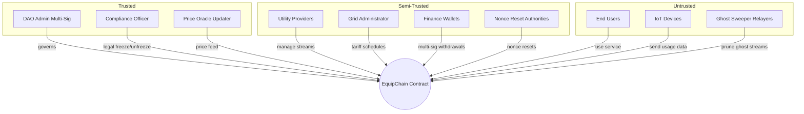

# EquipChain Contracts — Security Documentation

> **Classification:** CONFIDENTIAL — DAO Core Team Only  
> **Last Updated:** 2026-07-25  
> **Audit Status:** Ready for external audit

---

## Table of Contents

1. [Trust Model](#1-trust-model)
2. [Known Assumptions](#2-known-assumptions)
3. [Emergency Procedures](#3-emergency-procedures)
4. [Bug Bounty Program](#4-bug-bounty-program)
5. [Role-Based Access Control](#5-role-based-access-control)
6. [Security Features by Component](#6-security-features-by-component)
7. [Threat Model](#7-threat-model)
8. [Dependencies & Supply Chain](#8-dependencies--supply-chain)

---

## 1. Trust Model

### 1.1 Trust Zones



### 1.2 Trust Assumptions

| # | Assumption | Risk if Broken |
|---|------------|----------------|
| 1 | DAO admin multi-sig keys are held by distinct, non-colluding entities | Full contract takeover |
| 2 | Price oracle provides accurate, timely prices | Incorrect billing |
| 3 | Device Ed25519 keys are securely generated and stored | Identity spoofing |
| 4 | IoT device firmware signs correct usage data | Billing fraud |
| 5 | Network validators are honest and available | Censorship / reorgs |
| 6 | Compliance officer follows legal due process | Unjustified freezes |
| 7 | At least one finance wallet remains honest | Theft of provider funds |

---

## 2. Known Assumptions

### 2.1 System Assumptions

1. **Ledger timestamps are monotonic and trusted** — Soroban provides ledger timestamps that are cryptographically committed. The contract relies on these for all time-based calculations (peak hours, deadlines, cooldowns).

2. **Ed25519 signatures are secure** — The contract uses Soroban's built-in `ed25519_verify`. Security depends on the host function implementation and the device's key management.

3. **Token contracts are Standard Asset Contracts (SAC)** — All token interactions assume SAC-compliant contracts with standard `transfer`, `balance`, `burn` interfaces.

4. **Cross-contract calls are atomic** — Soroban guarantees atomic execution within a single contract invocation. No partial state updates.

5. **Storage is durable** — Contract instance storage persists across invocations. Temporary storage has TTL limitations.

### 2.2 Operational Assumptions

1. **Oracle is regularly updated** — `MAX_PRICE_AGE_SECONDS` (300s) requires the price updater to push updates at least every 5 minutes.

2. **Devices send heartbeats within threshold** — `HEARTBEAT_THRESHOLD_SECONDS` (3600s) means devices must heartbeat at least hourly.

3. **Providers monitor their streams** — The contract emits events but relies on providers to detect and respond to anomalies.

4. **Multi-sig coordination happens off-chain** — The contract enforces thresholds but does not manage the off-chain coordination process.

### 2.3 Limitations

| Limitation | Impact | Mitigation |
|------------|--------|------------|
| No native random number generation | Predictable challenges for pairing | Use ledger hash as entropy source |
| No private data on-chain | Usage data is visible to all | ZK-proof system (future) |
| Temporary storage TTL | Data may expire if not refreshed | Auto-extend mechanism and periodic flushing |
| No front-running protection | Miners could observe and front-run transactions | Timelock on critical operations |
| No native oracle integration | Price data is single-source | Oracle address is configurable |

---

## 3. Emergency Procedures

### 3.1 Emergency Actions

| Action | Required Role | Description |
|--------|---------------|-------------|
| `emergency_freeze_all_streams()` | DAO Admin | Immediately halts all stream activity |
| `pause_nonce_verification()` | Grid Admin | Disables nonce checks during incident |
| `emergency_lock_tariff_oracle()` | Grid Admin | Prevents further tariff updates |
| `enable_emergency_monitoring()` | DAO Admin | Enables enhanced event emission |
| `emergency_disable()` | SecureCall Admin | Halts all cross-contract calls |

### 3.2 Incident Response Scenarios

For detailed runbooks covering 13 incident scenarios, see the full audit-ready runbook embedded in `README.md`. Key scenarios:

| Scenario | Trigger | First Action |
|----------|---------|--------------|
| Active exploit | Suspicious events | `emergency_freeze_all_streams()` |
| Admin key compromise | Unauthorized admin transactions | Multi-sig emergency rotation |
| Oracle failure | Stale price data | `set_oracle()` with backup oracle |
| Gas buffer exhaustion | Failed provider transactions | `top_up_gas_buffer()` |
| Nonce desync attack | Nonce alert events | Quarantine device, reset nonce |
| Tariff oracle compromise | Invalid rates | `emergency_lock_tariff_oracle()` |
| Ghost stream bloat | High storage usage | `batch_prune_ghost_streams()` |
| Velocity limit breach | Anomalous outflow | Review and adjust velocity config |

### 3.3 Contact Tree

```
Level 1 (Immediate): DAO Admin → Compliance Officer
Level 2 (15 mins):  Grid Administrator → Finance Wallets
Level 3 (30 mins):  All Providers → Security Team
Level 4 (1 hour):   Community → Public Relations
```

---

## 4. Bug Bounty Program

### 4.1 Program Overview

EquipChain operates a bug bounty program for the contracts in this repository. Security researchers are encouraged to responsibly disclose vulnerabilities.

| Severity | Reward Range | Response SLA |
|----------|-------------|--------------|
| Critical | $10,000 – $50,000 | 24 hours |
| High | $5,000 – $10,000 | 48 hours |
| Medium | $1,000 – $5,000 | 72 hours |
| Low | $500 – $1,000 | 1 week |
| Informational | — | — |

### 4.2 Scope

**In Scope:**
- All contract code in `contracts/utility_contracts/src/`
- All contract code in `contracts/price_oracle/src/`
- Build and deployment scripts

**Out of Scope:**
- Third-party dependencies (Soroban SDK, etc.)
- Infrastructure-level attacks on the Stellar network
- Phishing attacks on users
- Already documented issues

### 4.3 Disclosure Policy

1. Report vulnerabilities to `security@equipchain.io`
2. Do not post details publicly until the fix is deployed
3. Allow 7 days for critical/high fixes before public disclosure
4. Include clear reproduction steps and impact analysis

### 4.4 Rewards Criteria

Rewards are based on:
- Impact severity (financial loss, data breach, service disruption)
- Quality of the report (clear PoC, reproduction steps)
- Novelty of the attack vector

---

## 5. Role-Based Access Control

### 5.1 On-Chain Roles

| Role | Key | Authority |
|------|-----|-----------|
| **DAO Admin** | `DataKey::CurrentAdmin` | Propose upgrades, set officers, freeze streams, emergency drain |
| **Compliance Officer** | `DataKey::ComplianceOfficer` | Legal freeze/unfreeze |
| **Oracle Updater** | PriceOracle `Updater` | Update price feed |
| **Grid Administrator** | `DataKey::TariffOracleAdmin` | Manage tariff schedules |
| **Nonce Reset Authority** | `DataKey::AuthorizedNonceResetters` | Reset device nonces (multi-sig) |
| **Provider** | Per-meter `provider` | Manage streams, withdraw earnings |
| **Finance Wallet** | `MultiSigConfig.finance_wallets` | Approve large withdrawals (3-of-5) |
| **Upgrade Signer** | `UpgradeMultiSigConfig.signers` | Approve WASM upgrades |
| **Ghost Sweeper** | Any | Prune ghost streams for bounty |

### 5.2 Permission Matrix

| Operation | Admin | Comp. Officer | Provider | User | Upgrader | Finance | Grid Admin | Oracle |
|-----------|-------|---------------|----------|------|----------|---------|------------|--------|
| Register meter | | | | ✓ | | | | |
| Top up | | | | ✓ | | | | |
| Claim | | | ✓ | | | | | |
| Freeze streams | ✓ | | | | | | | |
| Legal freeze | | ✓ | | | | | | |
| Propose upgrade | | | | | ✓ | | | |
| Update price | | | | | | | | ✓ |
| Update tariff | | | | | | | ✓ | |
| Reset nonce | | | | | | | | |
| Prune ghost | | | | | | | | |

---

## 6. Security Features by Component

### 6.1 Nonce Sync (Issue #260)

- Replay attack prevention via strictly incrementing u64 nonces
- +1 to +5 tolerance window for UDP jitter
- Multi-sig nonce reset for compromised devices
- Suspicious device auto-detection
- Full audit trail

### 6.2 Tariff Oracle (Issue #261)

- 24-hour notice period for tariff changes
- Cryptographic signature verification
- Grid administrator access control
- Temporary storage optimization
- Seamless rate interpolation across windows

### 6.3 Ghost Sweeper (Issue #262)

- 90-day threshold before pruning
- Cryptographic archive hashes for integrity
- Gas bounty incentives for relayers
- Protection for streams with pending buffers
- Historical audit trail preservation

### 6.4 Secure Call Interface

- Contract whitelisting with function-level permissions
- Call depth limits (max 5) to prevent reentrancy
- Gas limits per cross-contract call
- Rate limiting (10 calls per 60s window)
- Emergency disable capability

### 6.5 Velocity Limit Circuit Breaker

- Per-stream and global 24h rolling limits
- Anomalous activity event emission
- Admin multi-sig overrides for false positives
- Auto-reset at day boundaries

### 6.6 Upgrade Multi-Sig

- Minimum 2, maximum 7 authorized signers
- Configurable approval threshold
- 48-hour timelock default (min 24h)
- 14-day proposal expiry
- Cancellation by proposer

---

## 7. Threat Model

| Threat Vector | Impact | Likelihood | Mitigation |
|--------------|--------|------------|------------|
| Replay attack on device heartbeat | Service disruption | Medium | Nonce sync (Issue #260) |
| Price manipulation via stale oracle | Incorrect billing | Low | Staleness check (300s) |
| Ledger bloat from abandoned streams | High storage costs | Medium | Ghost sweeper (Issue #262) |
| Admin key compromise | Full contract takeover | Low | Multi-sig, timelocks |
| Reentrancy via cross-contract calls | State corruption | Low | Depth limit, reentrancy guard |
| Integer overflow in billing | Financial loss | Low | Saturating arithmetic |
| Front-running of withdrawals | MEV extraction | Low | Rate limits |
| Device identity spoofing | Billing fraud | Medium | Ed25519 verification |
| Flash drain via unlimited claims | Fund loss | Low | Velocity limits, hourly caps |
| Upgrade governance attack | Malicious code | Low | Multi-sig, 48h timelock |

---

## 8. Dependencies & Supply Chain

### Runtime Dependencies

| Dependency | Version | Purpose |
|------------|---------|---------|
| `soroban-sdk` | 23.2.4 | Soroban smart contract framework |
| Stellar network | — | Ledger and consensus |

### Supply Chain Security

- All dependencies are pinned to specific versions
- `soroban-sdk` is developed by Stellar Development Foundation — a trusted entity
- CI/CD pipeline verifies dependency integrity via Cargo.lock
- WASM binaries are reproducible from source
- No vendored or forked dependencies

---

*This document is confidential. For authorized personnel only.*
